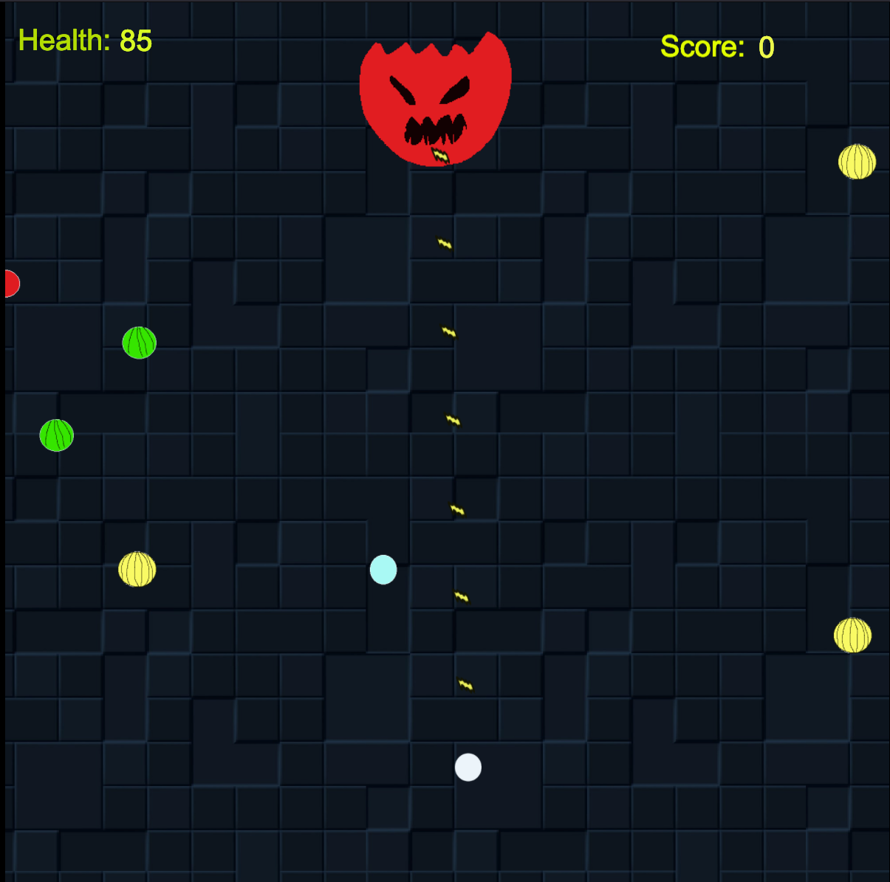

# Terrible Tiles Server

This was a simple server that was meant to be built for a simple group project for a game design class. While I was able to implement all the server functionality in the given time frame, unfortunately life happened and my group simply ended up with all the game logic on the client side (Construct 3). Furthermore, the client side also ended up quite different due to time constraints, and many server features were cut or changed from that version.

## Gameplay

The game itself was a singleplayer game about dodging falling tiles and collecting as many items as possible to deal damage to a boss who would attack you and to increase your score. 

Collecting items would deal damage to the boss, increasing your score and position on the leaderboard. Furthermore, the scoring system rewards efficient gameplay using metrics such as the total number of tiles dropped, total items collected, and the total number of player moves in relation to the amount of damage dealt to the boss. Less is more for all of these metrics due to enfore player efficiency, meaning a lower number of player moves would obtain a higher score for example.

Every second (except for every 5th second), the game would drop a random tile from the board which is 25 x 15 in size. If the player ever collides with a fallen tile, they die which reduces the player's overall score by 40%. Additionally, every 5th second the boss will either attack you, pushing you back 2-4 tiles on the y axis (which can push you into a fallen tile), or generate a bunch of items based on how many tiles are left on the board.

There are 4 classes of items, each which do a different number of damage to the boss. The more damage the item does, the lower its spawn rate. Additionally, a good strategy would be for the player to prioritize items that do more damage as defeating the boss with less items will lead to an increased score at the end of the game.

The boss itself has 500 HP, whether this was a fair amount could never be determined since the client was never integrated. Collecting items is the only way to damage the boss, and additionally boss damage is the biggest factor in scoring as defeating the boss increases the player's score by 40%.

## Todo (For fun in the future)

As time goes on I may (for fun) implement some of these features below...

- [ ] Make the server only send back the tiles that changed on the board rather than the entire board itself
- [x] Make y-axis more accurate to moving up and down on a standard cartesian coordinate plane
- [ ] Integrate mutliplayer, and maybe instead of a boss (looking back the boss kind of felt out of place to me), have players fight each other by collecting items
- [ ] More scalable scoring system database instead of just using SQLite
- [ ] Make an actual web (or iOS/macOS) client so the game can actually be played normally
- [x] Implement controls to allow for buttons to be held down on a client rather than forcing the client to send a socket command to move the player
